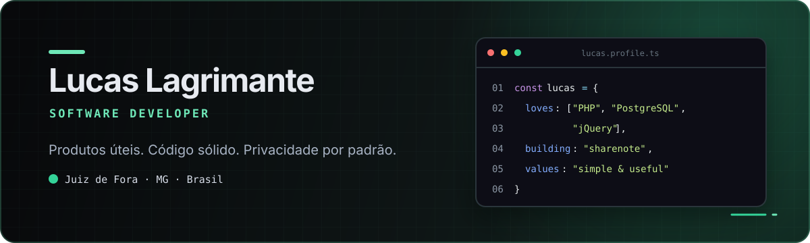
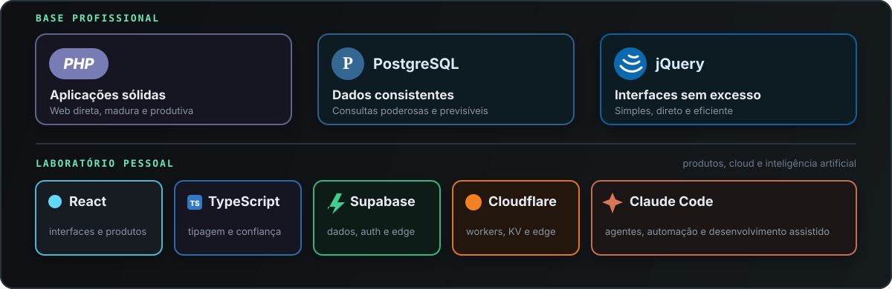

  

  <strong>
    <a href="#projetos-selecionados">Projetos</a>
    &nbsp;·&nbsp;
    <a href="https://sharenote.lucaslagrimante.workers.dev/">Abrir sharenote ↗</a>
    &nbsp;·&nbsp;
    <a href="https://lucaslagrimante.github.io/">Portfólio ↗</a>
    &nbsp;·&nbsp;
    <a href="https://github.com/LucasLagrimante?tab=repositories">Repositórios</a>
  </strong>

  <code>● construindo agora: sharenote</code>

## `01` — O que me move

Construo software para resolver problemas reais. Gosto de produtos que parecem simples para quem usa, mesmo quando existe bastante engenharia por trás — especialmente quando envolvem **privacidade**, **performance** e **dados bem cuidados**.

- 📍 Juiz de Fora, Minas Gerais
- 🧩 Menos complexidade acidental, mais valor entregue
- 🔐 Segurança e privacidade desde a primeira decisão
- 🛠️ Código pragmático, legível e feito para durar

## `02` — Projeto em destaque

<table>
  <tr>
    <td width="68%" valign="top">
      <h3>🔐 sharenote</h3>
      
<strong>Markdown compartilhável. Privacidade de verdade.</strong>

      
Um editor para criar notas e compartilhá-las por links temporários. O conteúdo é criptografado no navegador antes de sair do dispositivo — a chave nunca chega ao servidor.

      
<code>React</code> <code>TypeScript</code> <code>Cloudflare Workers</code> <code>Web Crypto API</code>

      
<strong><a href="https://sharenote.lucaslagrimante.workers.dev/">EXPERIMENTAR O SHARENOTE ↗</a></strong>

    </td>
    <td width="32%" align="center" valign="middle">
      
<strong>PRIVACY-FIRST</strong>

      
🔒 CRIPTOGRAFADO NO NAVEGADOR

      
⏱️ LINKS QUE EXPIRAM

      
🚫 SEM CONTA OBRIGATÓRIA

    </td>
  </tr>
</table>

## `03` — Projetos selecionados

<table id="projetos-selecionados">
  <tr>
    <td width="50%" valign="top">
      <h3>🌍 <a href="https://github.com/LucasLagrimante/globaldev-os">globaldev-os</a></h3>
      
Career OS <em>local-first</em> e open source para quem busca oportunidades internacionais em tecnologia.

      
<code>TypeScript</code> <code>Local-first</code> <code>Open source</code>

      
<a href="https://github.com/LucasLagrimante/globaldev-os"><strong>VER CÓDIGO →</strong></a>

    </td>
    <td width="50%" valign="top">
      <h3>🎮 <a href="https://github.com/LucasLagrimante/lagri-brawl">Lagri Brawl</a></h3>
      
Encontre os melhores personagens de Brawl Stars para dominar cada mapa e modo de jogo.

      
<code>JavaScript</code> <code>Game data</code> <code>GitHub Pages</code>

      
<a href="https://github.com/LucasLagrimante/lagri-brawl"><strong>VER PROJETO →</strong></a>

    </td>
  </tr>
  <tr>
    <td width="50%" valign="top">
      <h3>🦸 <a href="https://lucaslagrimante.github.io/marvel-rivals-coach/">Marvel Rivals Coach</a></h3>
      
Guias rápidos de coaching para escolher personagens e decidir a próxima luta em Marvel Rivals.

      
<code>React</code> <code>TypeScript</code> <code>Game strategy</code>

      
<a href="https://lucaslagrimante.github.io/marvel-rivals-coach/"><strong>ABRIR APP ↗</strong></a> · <a href="https://github.com/LucasLagrimante/marvel-rivals-coach">CÓDIGO</a>

    </td>
    <td width="50%" valign="top">
      <h3>👨‍💻 <a href="https://lucaslagrimante.github.io/">Página pessoal</a></h3>
      
Meu espaço na web: experiência, projetos e o trabalho que estou construindo como engenheiro de software.

      
<code>Portfolio</code> <code>JavaScript</code> <code>GitHub Pages</code>

      
<a href="https://lucaslagrimante.github.io/"><strong>VISITAR ↗</strong></a> · <a href="https://github.com/LucasLagrimante/lucaslagrimante.github.io">CÓDIGO</a>

    </td>
  </tr>
  <tr>
    <td width="50%" valign="top">
      <h3>🧒 <a href="https://github.com/LucasLagrimante/aprendeplay">AprendePlay</a></h3>
      
Experiência educativa multilíngue para crianças aprenderem números, letras e cores.

      
<code>TypeScript</code> <code>Educação</code> <code>Acessibilidade</code>

      
<a href="https://github.com/LucasLagrimante/aprendeplay"><strong>VER PROJETO →</strong></a>

    </td>
    <td width="50%" valign="top">
      <h3>🧰 <a href="https://github.com/LucasLagrimante/agent-sync">agent-sync</a></h3>
      
Padroniza configurações de agentes de IA em vários projetos usando uma única fonte da verdade.

      
<code>Python</code> <code>CLI</code> <code>Developer tools</code>

      
<a href="https://github.com/LucasLagrimante/agent-sync"><strong>VER CÓDIGO →</strong></a>

    </td>
  </tr>
</table>

<strong><a href="https://github.com/LucasLagrimante?tab=repositories">VER TODOS OS REPOSITÓRIOS →</a></strong>

## `04` — Minha base favorita

  

Também trabalho com `TypeScript`, `React`, `Laravel`, `Python`, `Cloudflare Workers` e ferramentas de IA para desenvolvimento.

---

  <strong>Código bom resolve o problema e respeita quem usa.</strong> 
  Explore os projetos, abra uma issue ou acompanhe o que estou construindo.

